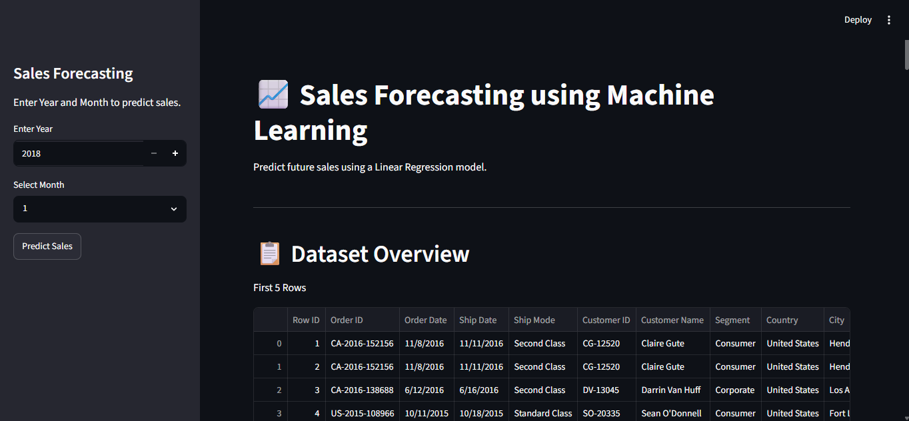
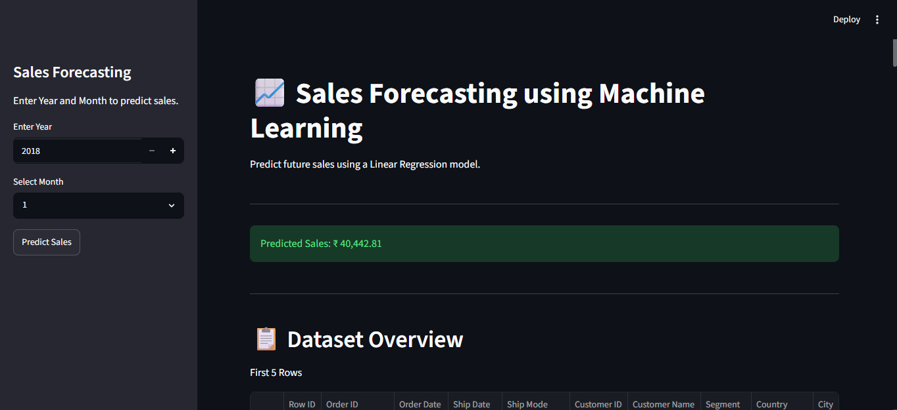
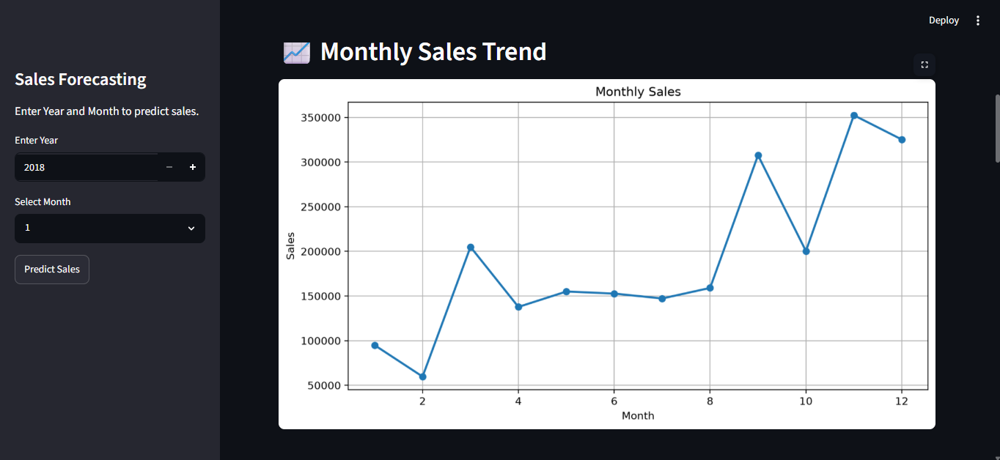
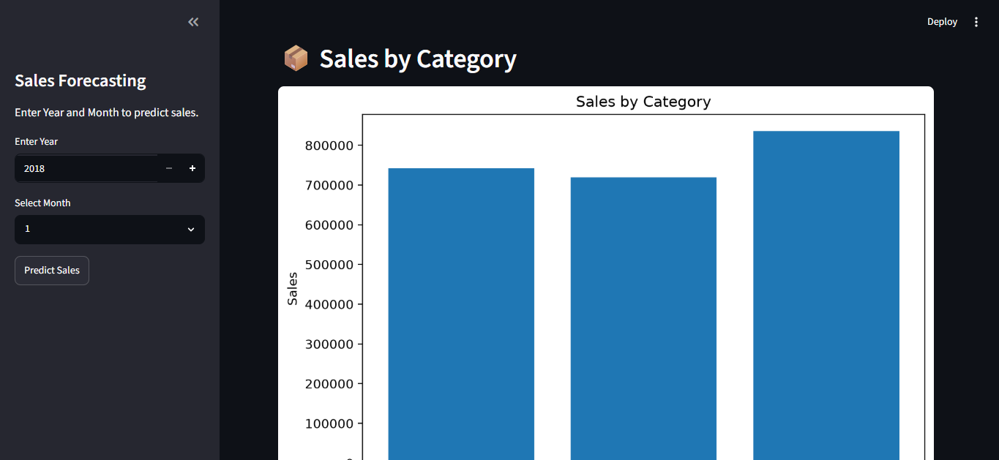
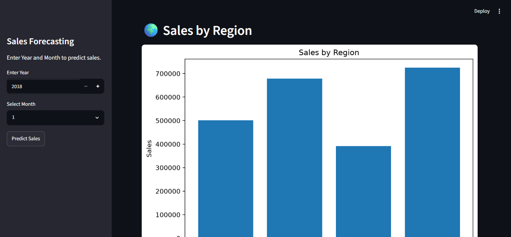
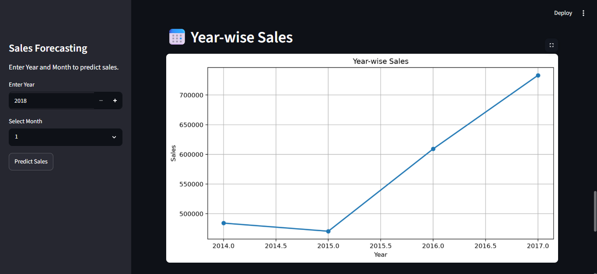

# Sales Forecasting using Machine Learning

## Project Overview
This project predicts future sales using a Linear Regression Machine Learning model. It is built with Python and Streamlit and uses the Superstore Sales dataset.

## Project Demo

### Home Page

### Sales Prediction

### Monthly Sales Trend

### Sales by Category

### Sales by Region

### Year-wise Sales

## Features
- Predict future sales by Year and Month
- Interactive Streamlit web application
- Dataset overview
- Monthly Sales Trend
- Sales by Category
- Sales by Region
- Year-wise Sales Analysis

## Technologies Used
- Python
- Pandas
- NumPy
- Matplotlib
- Scikit-learn
- Streamlit
- Joblib

## Machine Learning Model
- Linear Regression

## Workflow
1. Data Collection
2. Data Cleaning
3. Exploratory Data Analysis (EDA)
4. Feature Engineering
5. Model Training
6. Model Evaluation
7. Sales Prediction
8. Streamlit Deployment

## Dataset
Sample Superstore Dataset

## Author
Chambrish Prabhu